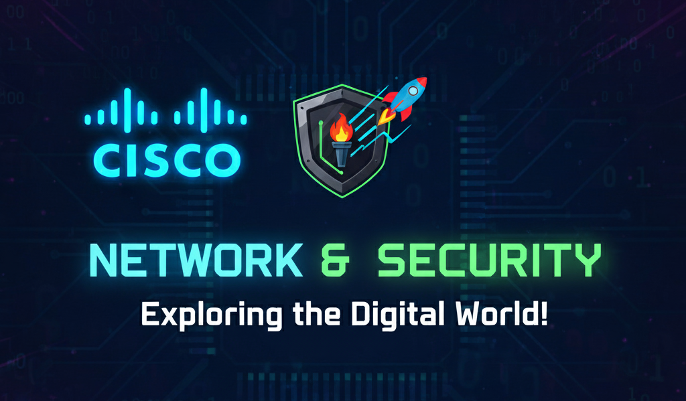

# Hi there, I'm Cristhian Abimayu Wibowo 👋
### Network Engineer | Cyber Security Enthusiast

I am a Bachelor of Computer Science graduate with a strong interest in **Network Infrastructure** and **Cyber ​​Security**.

---

### 🛠️ Technical Arsenal

| **Networking & Infrastructure** | **Blue Team (Defense)** | **Web Architecture** | **Programming Language** |
| :--- | :--- | :--- | :--- |
|  |  |  |  |
|  |  |  |  |
|  |  |  |  |
|  | | 
 |  |
| | | |  |

---

### ⚔️ Learning Bug Bounty
I am currently studying **Bug Bounty** especially on **domain assets** and have my own methodology for doing Bug Bounty:

1.  🕵️‍♂️ **Reconnaissance:** Collect target information passively and actively, using Subfinder, Katana, crt.sh, ffuf, LinkFinder, Httpx, Wappalyzer tools.
2.  🔓 **Exploitation:** Running attacks based on discovered vulnerabilities. I execute attacks cautiously for fear of violating policies, and I typically don't use any active tools, just **Burpsuite**.
3.  🚩 **Post-Exploitation:** Create concept documentation (PoC) and impact analysis (privilege escalation).

---

### 📫 Connect with Me
* [LinkedIn](https://www.linkedin.com/in/cristhian-abimayu-wibowo-a7b092208/)
* [Email](mailto:abimayuwibowo@gmail.com)
<!--
**Cristhian4456/Cristhian4456** is a ✨ _special_ ✨ repository because its `README.md` (this file) appears on your GitHub profile.

Here are some ideas to get you started:

- 🔭 I’m currently working on ...
- 🌱 I’m currently learning ...
- 👯 I’m looking to collaborate on ...
- 🤔 I’m looking for help with ...
- 💬 Ask me about ...
- 📫 How to reach me: ...
- 😄 Pronouns: ...
- ⚡ Fun fact: ...
-->
